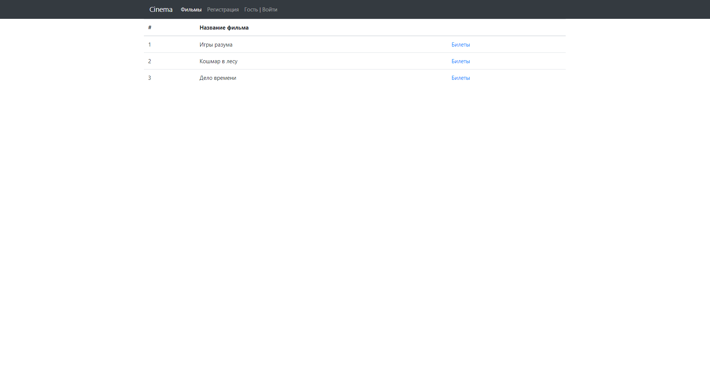
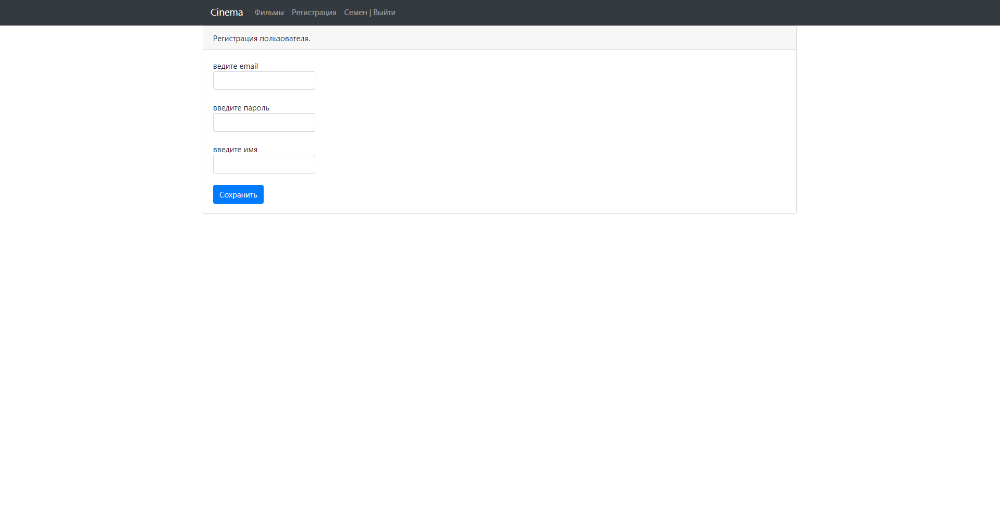
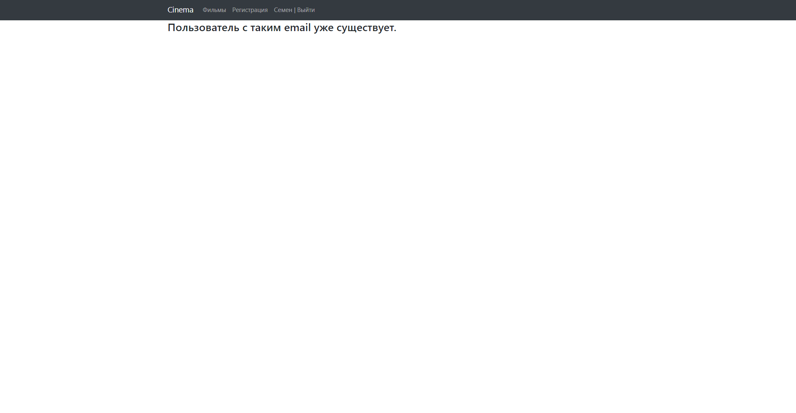
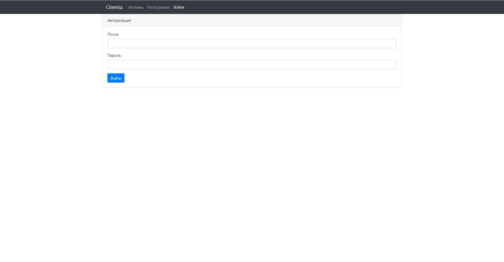
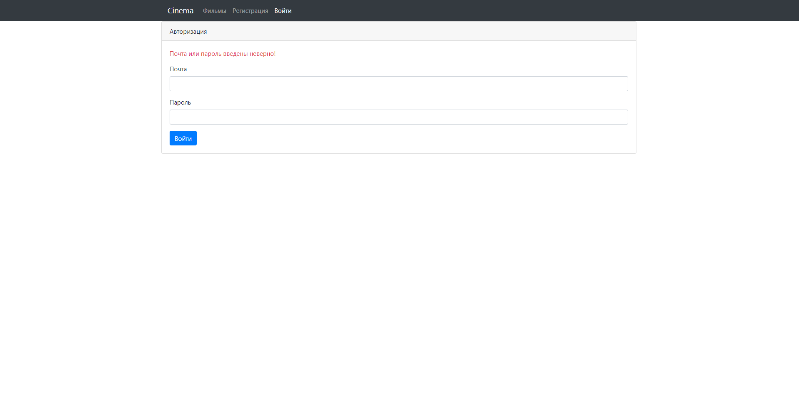
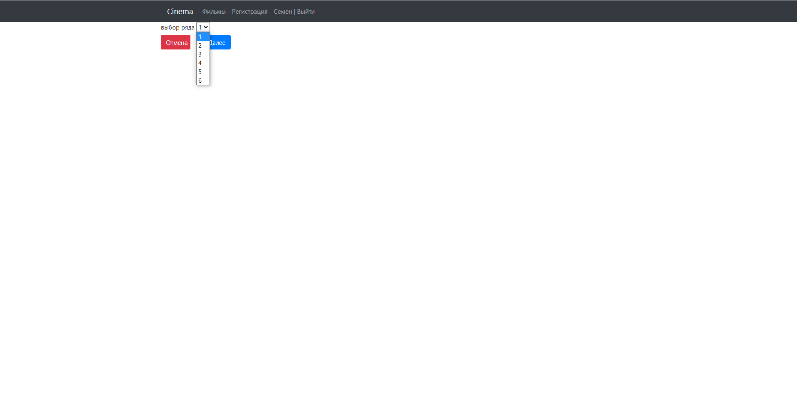
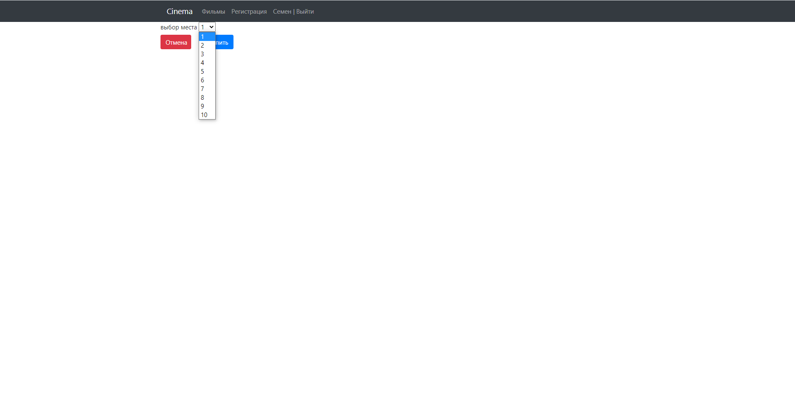
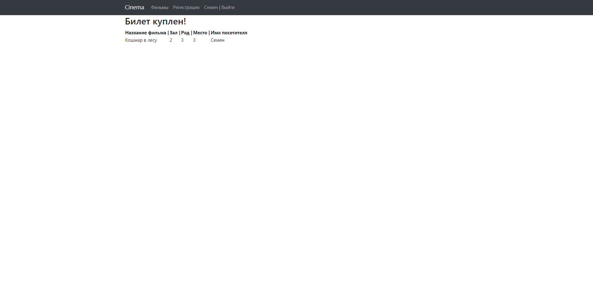
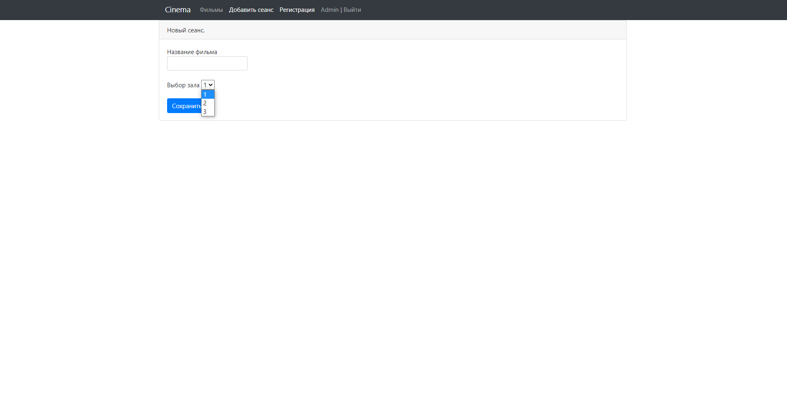

# Cinema

# Описание проекта
Данный проект представляет собой сервис по покупке билетов в кинотеатр. 
На главной странице показан список всех фильмов.
При выборе фильма пользователь попадет на страницу с выбором ряда, после чего на страницу с выбором места. 
После выбора места пользователь попадет на страницу с информацией о сеансе с двумя кнопками "купить" и "отменить". 
Пользователь может купить билет на сеанс только при условии, что выбранные им места не заняты другим пользователем.

# Стек технологий
- Java 17
- SpringBoot 2.7.4
- Thymeleaf 2.7.4
- Bootstrap 4.4.1
- PostgreSQL 14
- Junit 5.8.2
- AssertJ 3.23.1
- Log4j 1.2.17
- Jcip annotations 1.0
- h2database 2.1.214
- Mockito 3.5.13
- Checkstyle-plugin 3.1.2
- Liquibase 4.15.0

# Требования к окружению
- Java 17
- Maven 3.8
- PostgreSQL 14

# Взаимодействие с приложением
#### Главная страница с фильмами

#### Страница регистрации пользвателя

#### Страница успешной регистрации пользователя

#### Страница ошибки при регистрации пользователя

#### Страница авторизации пользователя

#### Страница ошибки при авторизации

#### Страница выбора ряда на фильм

#### Страница выбора места на фильм

#### Страница успешной покупки билета

#### Страница ошибки при покупке билета уже занятого места

#### Страница добавлении сеанса при входе пользователем "Admin"
